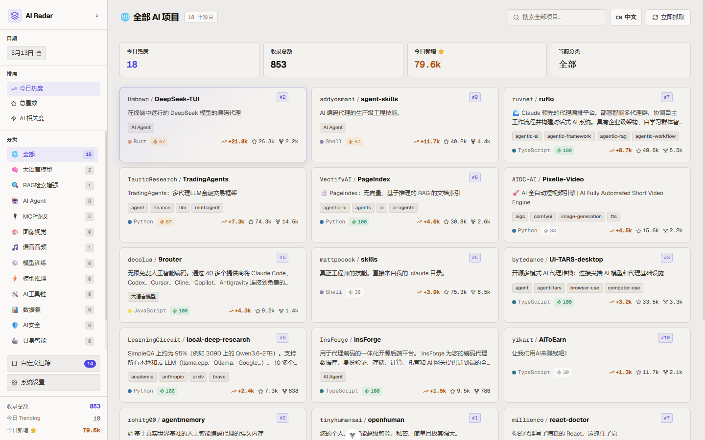
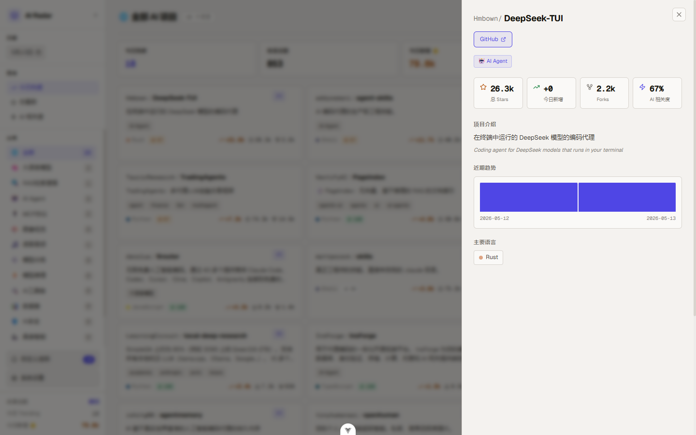
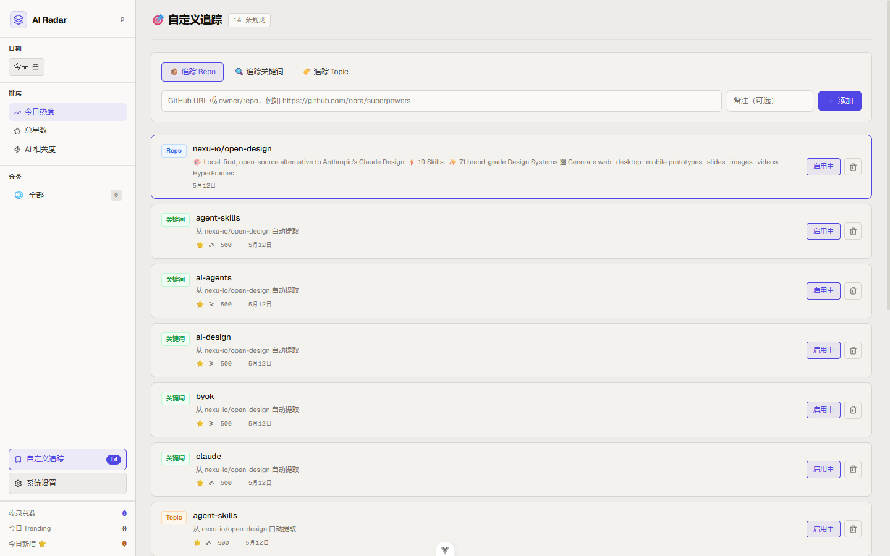
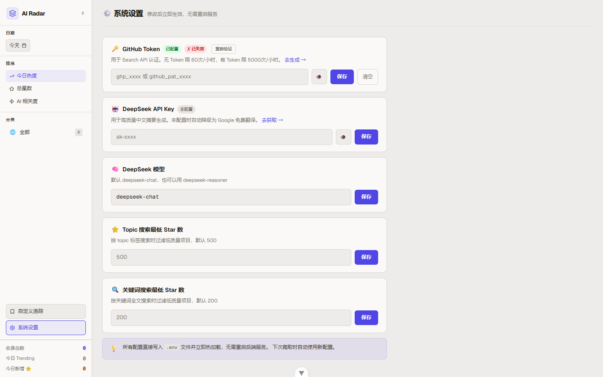

# AI GitHub Radar 🔭

> 每日自动追踪 GitHub 上最热门的 AI 项目，智能分类、中文摘要、趋势分析，一站式掌握 AI 开源动态。


---

## 📸 界面预览

### 主页 - 项目列表


### 项目详情 - 趋势分析


### 自定义追踪管理


### 系统设置 - 热加载配置


---

## ✨ 功能特性

### 数据采集
- **双轨爬取**：GitHub Trending 页面（今日热度）+ Search API（按 topic/关键词）
- **并发请求**：Search API 并发执行，提升爬取效率
- **30+ AI 分类关键词**：覆盖 LLM、RAG、Agent、MCP、图像视觉、语音音频等
- **自定义追踪**：输入任意 GitHub URL 或 `owner/repo`，立即收录并自动提取关键词
- **每日定时**：凌晨 2 点自动执行，无需人工干预

### 智能分类
14 个 AI 细分分类，自动打标：

| 分类 | 说明 |
|------|------|
| 🧠 大语言模型 | LLM、GPT、Claude、Llama 等 |
| 🔍 RAG检索增强 | 向量数据库、知识库、语义搜索 |
| 🤖 AI Agent | 自主代理、多 Agent 框架 |
| 🔌 MCP协议 | Model Context Protocol 工具 |
| 🎨 图像视觉 | 图像生成、目标检测、多模态 |
| 🎵 语音音频 | ASR、TTS、音频生成 |
| ⚙️ 模型训练 | 微调、RLHF、LoRA |
| ⚡ 模型推理 | 量化、加速、部署 |
| 💻 代码生成 | AI 编程助手、代码补全 |
| 🦾 具身智能 | 机器人、强化学习 |
| 🛡️ AI安全 | 对齐、红队测试 |
| 🛠️ AI工具链 | 框架、SDK、平台 |
| 📊 数据集 | 训练数据、评测基准 |
| ✨ 其他AI | 其他 AI 相关项目 |

### 中文化

#### 🤖 按需翻译
- **单卡翻译**：悬停卡片右上角显示翻译按钮，按需翻译单个项目
- **引擎选择**：支持 DeepSeek / Google / 自动选择翻译引擎
- **后台异步**：翻译在后台执行，不阻塞界面交互

#### 🌐 批量翻译
- **DeepSeek 高质量翻译**：配置 API Key 后，自动生成中文项目名称、摘要、标签
- **Google 免费翻译降级**：无 Key 时自动降级为 Google 翻译，保证基本可用
- **智能缓存**：已翻译项目不重复消耗 token，内容变化时才重新翻译
- **中英文无缝切换**：前端一键切换，已翻译内容即时展示

### 前端展示

#### 🌐 中英文一键切换
- **智能双语展示**：点击顶部语言按钮（🇨🇳/🇺🇸），立即切换项目名称、描述、标签的显示语言
- **中文优先**：有翻译摘要的项目，中文模式下优先展示中文内容
- **无缝体验**：语言切换即时生效，无需刷新页面，状态自动保持

#### 📊 项目卡片
- **核心信息一目了然**：项目名称、描述、语言、AI 相关度评分、今日新增 Star、总 Star、Fork 数
- **排名标记**：Trending Top 10 项目显示排名徽章

#### 🔍 详情抽屉
- **点击卡片展开详情**：完整项目介绍、近期 30 天趋势图、分类标签
- **趋势可视化**：柱状图展示每日新增 Star，快速识别热度变化
- **原文对照**：中文模式下，翻译摘要下方显示英文原文

#### 📋 列表交互
- **三种排序**：今日热度（Trending）/ 总星数 / AI 相关度
- **升降序切换**：点击排序按钮切换升序/降序
- **分类筛选**：左侧导航点击分类，数量实时联动
- **全量搜索**：后端搜索，覆盖名称、描述、中文摘要
- **无限滚动**：自动加载更多，滚动到底部无缝追加
- **日期穿越**：选择历史日期，查看当日 Trending 情况

### 系统管理

#### ⚙️ 在线配置
- **热加载配置**：修改 GitHub Token、DeepSeek Key 后立即生效，无需重启服务
- **Token 验证**：自动检测 GitHub Token 有效性，失效时显示红色警告
- **最低 Star 阈值**：可调整 Topic 搜索 / 关键词搜索的最低 Star 过滤值

#### 🎯 自定义追踪
- **追踪指定 Repo**：输入 GitHub URL 或 `owner/repo`，立即收录并自动提取关键词
- **追踪关键词**：设置关键词 + 最低 Star 数，每次爬取时自动搜索匹配项目
- **追踪 Topic**：跟踪特定 GitHub Topic 标签下的项目动态
- **启用/禁用**：灵活控制追踪规则状态，无需删除

---

## 🏗️ 技术架构

```
AIgithub/
├── backend/                 # Python FastAPI 后端
│   ├── api/
│   │   ├── routes.py        # 主要 API 接口
│   │   └── config_routes.py # 系统配置接口（热加载）
│   ├── crawler/
│   │   ├── github_client.py # GitHub API + Trending 爬虫
│   │   ├── classifier.py    # AI 项目分类器
│   │   ├── translator.py    # 翻译模块（DeepSeek / Google）
│   │   ├── storage.py       # 数据库存储层
│   │   ├── track_service.py # 自定义追踪服务
│   │   └── runner.py        # 爬取主流程（并发 + 后台翻译）
│   ├── config.py            # 配置管理
│   ├── database.py          # SQLAlchemy 引擎与会话工厂
│   ├── models.py            # SQLAlchemy 数据模型
│   ├── init_data.sql        # 初始化数据（分类 + 追踪规则）
│   ├── scheduler.py         # APScheduler 定时任务
│   └── main.py              # FastAPI 应用入口
└── frontend/                # Vue 3 前端
    └── src/
        ├── api/             # API 封装
        ├── stores/          # Pinia 状态管理
        ├── components/      # 公共组件
        │   ├── AppSidebar.vue
        │   ├── RepoCard.vue
        │   └── RepoDrawer.vue
        └── views/           # 页面
            ├── HomeView.vue     # 主页
            ├── TracksView.vue   # 追踪管理
            └── SettingsView.vue # 系统设置
```

---

## 🚀 快速开始

### 环境要求
- Python 3.12+
- Node.js 20.19+ 或 22.12+
- MySQL 8.0+

### 1. 克隆项目

```bash
git clone git@github.com:lucifer-Mok/AIgithub.git
cd AIgithub
```

### 2. 后端配置

```bash
cd backend

# 创建虚拟环境
python -m venv venv
venv\Scripts\activate  # Windows
# source venv/bin/activate  # Linux/Mac

# 安装依赖
pip install -r requirements.txt

# 复制配置文件
copy .env.example .env  # 或手动创建 .env
```

编辑 `.env`：

```env
# 数据库
DB_HOST=localhost
DB_PORT=3306
DB_USER=root
DB_PASSWORD=your_password
DB_NAME=ai_github

# GitHub Token（可选，无 Token 限 60次/小时）
# 获取：https://github.com/settings/tokens → Generate new token (classic)
GITHUB_TOKEN=ghp_xxxx

# DeepSeek API Key（可选，无 Key 自动降级为 Google 免费翻译）
# 获取：https://platform.deepseek.com/api_keys
DEEPSEEK_API_KEY=sk-xxxx
```

### 3. 初始化数据库

```sql
CREATE DATABASE ai_github DEFAULT CHARACTER SET utf8mb4;
```

然后启动后端，表结构会自动创建（通过 SQLAlchemy）。

表创建后，执行 `init_data.sql` 植入 14 个分类和示例追踪规则：

```bash
mysql -u root -p ai_github < init_data.sql
```

### 4. 启动后端

```bash
python main.py
```

访问 `http://localhost:8000/docs` 查看 API 文档。

### 5. 前端配置

```bash
cd frontend
npm install
npm run dev
```

访问 `http://localhost:5173`

### 6. 触发首次爬取

在前端点击"立即抓取"按钮，或调用：

```bash
curl -X POST http://localhost:8000/api/crawl/trigger
```

---

## 📡 API 接口

| 接口 | 说明 |
|------|------|
| `GET /api/repos` | 获取 repo 列表（支持分类、日期、排序、分页） |
| `GET /api/repos/search` | 全量搜索（名称、描述、中文摘要） |
| `GET /api/repos/{full_name}` | 获取 repo 详情及近 30 天趋势 |
| `POST /api/repos/{full_name}/translate` | 按需翻译单个 repo |
| `GET /api/stats/overview` | 首页概览统计 |
| `GET /api/stats/history` | 近 N 天每日新增 repo 趋势 |
| `GET /api/categories` | 获取所有分类 |
| `POST /api/crawl/trigger` | 手动触发爬取（后台异步） |
| `GET /api/crawl/logs` | 获取最近爬取日志 |
| `GET /api/tracks` | 获取自定义追踪列表 |
| `POST /api/tracks/repo` | 添加 repo 追踪 |
| `POST /api/tracks/keyword` | 添加关键词追踪 |
| `POST /api/tracks/topic` | 添加 topic 追踪 |
| `PATCH /api/tracks/{id}` | 更新追踪（启用/禁用、修改最低 Star） |
| `DELETE /api/tracks/{id}` | 删除追踪 |
| `GET /api/config` | 获取系统配置（密钥脱敏） |
| `POST /api/config` | 更新配置（热加载） |
| `DELETE /api/config/{key}` | 清除配置项 |
| `GET /api/config/verify/github` | 验证 GitHub Token |

---

## ⚙️ 爬取流程

每次爬取分 4 个阶段：

```
阶段 1：GitHub Trending（daily + weekly，合并去重）
    ↓ 获取今日/本周热门项目，记录 stars_today

阶段 2a：Search API ~30 个 AI topics（并发 x3，Semaphore 控速）
    ↓ 按 topic 标签搜索，覆盖各 AI 细分领域

阶段 2b：关键词全文搜索（并发 x3）
    ↓ 搜索名称/描述，捕获没打 topic 标签的优质项目

阶段 2c：自定义追踪
    ↓ 执行用户添加的 repo/keyword/topic 追踪规则

阶段 3：翻译（后台异步，不阻塞爬取响应）
    ↓ DeepSeek（有 Key，并发 x3）或 Google 免费翻译（并发 x5）
    ↓ 智能跳过：已是中文 / 内容未变化（MD5 hash）
```

---

## 🔧 自定义追踪

在追踪管理页面，支持三种追踪方式：

**追踪指定 Repo**
```
输入：https://github.com/obra/superpowers
或：nexu-io/open-design
```
立即收录，自动提取关键词加入追踪规则。

**追踪关键词**
```
关键词：agentic skills framework
最低 Star：100
```
每次爬取时搜索包含该关键词的项目。

**追踪 Topic**
```
Topic：mcp-server
最低 Star：100
```
每次爬取时搜索带有该 topic 标签的项目。

---

## 📝 License

MIT
